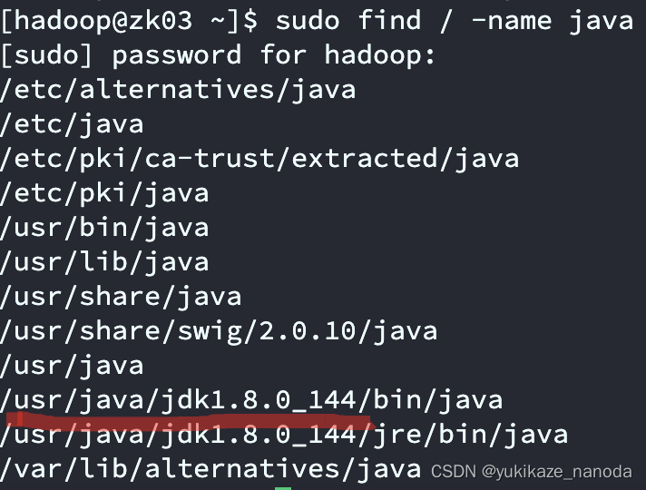

# Linux环境下如何配置JAVA_HOME

1、输入命令 ：

```
echo $JAVA_HOME
```

如有显示出路径，说明已经进行了配置，否则继续下一步。

2、找到本机jdk安装的位置：

```
find / -name java
```


3、[vim](https://so.csdn.net/so/search?q=vim&spm=1001.2101.3001.7020) /etc/profile
在文件最后加入：

```
export JAVA_HOME=/usr/java/jdk1.8.0_144
export JRE_HOME=$JAVA_HOME/jre
export CLASSPATH=$JAVA_HOME/lib:$JRE_HOME/lib:$CLASSPATH
export PATH=$JAVA_HOME/bin:$JRE_HOME/bin:$PATH
```

4、`source /etc/profile`，刷新文件，立即生效