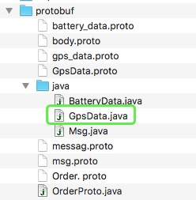
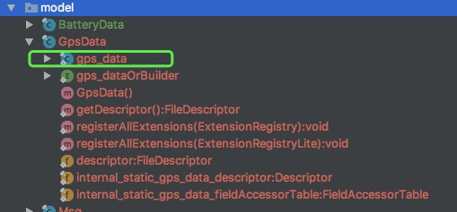

# protobuf 3.5 java使用介绍（一）

网上大多的资料都是老版本的protobuf例子，正好用到了这个技术，我就把protobuf 3.5的使用方法记录一下，重点写了使用方法以及注意事项。

**proto描述文件的编写**

语法

3.5的语法跟以前的protobuf语法有很大的变化，详细的可以参考官方文档，

地址：https://developers.google.com/protocol-buffers/docs/proto3

这里有一个中文翻译的文档
地址：http://blog.csdn.net/u011518120/article/details/54604615

重点注意的地方有这么几点：句法申明、数据类型

例子

```
syntax = "proto3";

message gps_data {
    int64 id = 1;
    string terminalId = 2;
    string dataTime = 3;
    double lon = 4;
    double lat = 5;
    float speed = 6;
    int32 altitude = 7;
    int32 locType = 8;
    int32 gpsStatus = 9;
    float direction = 10;
    int32 satellite = 11;
}
```

注意：

* 顶部必须申明句法的版本号，如果不申明，则默认是2.0的语法。
* 下面Message节里面的字段就是业务需要的各个字段了，等号后面的数字是序号，必须指定。在3.5版本中不用指定required、等关键字了。
* gps_data 的名称格式与为生成的java文件的名称是有关系的，如果加入了下划线，则默认生成的是GpsData 这个驼峰格式的名称。当然你也可以在文件里自定义java文件的名称

如下：

`option java_outer_classname = "BatteryData";`

但是，生成的java代码中的的builder还是按照默认格式来生成的，所以，建议大家就直接按照默认规则来设计即可。

* 此外，还可以指定改java代码的包路径，命令如下：

`option java_package = "com.yjgis.test"; `

但是这里不建议使用这个功能，因为包路径会写入到生成的代码中，一旦，代码进行重构的时候，修改起来会很麻烦，还不如直接把包路径这种功能交给ide来完成

**JAVA代码的生成**


生成JAVA模型的命令
在命令行工具中敲入下面的命令


`protoc -I=src/main/resource/proto 
--java_out=src/main/java src/main/resource/proto/protobuf.proto`

说明：

-I 后面是proto文件所在的目录，

–java_out 后面是生成java文件存放地址

最后一行是proto文件的名称，可以写绝对地址，也可以直接写proto文件名称

生成的代码如下所示



绿色即是上面文件生成的代码。

**在JAVA中如何使用生成的数据模型**

把生成的这个java类拷贝到工程，如下图：



主要需要使用的对象就是绿色方框内的，下面，我们来写一些代码

测试代码
有如下三个功能即可满足在业务中的需要了，如下：

- 使用java代码生成一个数据模型

- 把模型转换为二进制数据流

- 把二进制数据流转成java对象
  
首先在测试工程pom里增加依赖

```
pom:

<dependency>
    <groupId>com.google.protobuf</groupId>
    <artifactId>protobuf-java</artifactId>
    <version>3.5.0</version>
</dependency>

JAVA代码:

import com.google.protobuf.InvalidProtocolBufferException;

public class TestGpsProtobuf {
    public static void main(String[] args) {
        System.out.println("===== 构建一个GPS模型开始 =====");
        GpsData.gps_data.Builder gps_builder = GpsData.gps_data.newBuilder();
        gps_builder.setAltitude(1);
        gps_builder.setDataTime("2017-12-17 16:21:44");
        gps_builder.setGpsStatus(1);
        gps_builder.setLat(39.123);
        gps_builder.setLon(120.112);
        gps_builder.setDirection(30.2F);
        gps_builder.setId(100L);

        GpsData.gps_data gps_data = gps_builder.build();
        System.out.println(gps_data.toString());
        System.out.println("===== 构建GPS模型结束 =====");
    
        System.out.println("===== gps Byte 开始=====");
        for(byte b : gps_data.toByteArray()){
            System.out.print(b);
        }
        System.out.println("\n" + "bytes长度" + gps_data.toByteString().size());
        System.out.println("===== gps Byte 结束 =====");
    
        System.out.println("===== 使用gps 反序列化生成对象开始 =====");
        GpsData.gps_data gd = null;
        try {
            gd = GpsData.gps_data.parseFrom(gps_data.toByteArray());
        } catch (InvalidProtocolBufferException e) {
            e.printStackTrace();
        }
        System.out.print(gd.toString());
        System.out.println("===== 使用gps 反序列化生成对象结束 =====");
    
    }

}
```

运行一下：

```
Connected to the target VM, address: '127.0.0.1:59012', transport: 'socket'
===== 构建一个GPS模型开始 =====
id: 100
dataTime: "2017-12-17 16:21:44"
lon: 120.112
lat: 39.123
altitude: 1
gpsStatus: 1
direction: 30.2

===== 构建GPS模型结束 =====
===== gps Byte 开始=====
810026195048495545495045495532495458504958525233-707312243794644157-76-56118-66-113676456172185-102-103-1565
bytes长度50
===== gps Byte 结束 =====
===== 使用gps 反序列化生成对象开始 =====
id: 100
dataTime: "2017-12-17 16:21:44"
lon: 120.112
lat: 39.123
altitude: 1
gpsStatus: 1
direction: 30.2
===== 使用gps 反序列化生成对象结束 =====
```

**如何快速的进行json格式化**

我们在使用protobuf的时候，有些场景是需要快速把protobuf生成的对象转成json的，protobuf提供了很方便的方法来实现这个功能。但是这个功能并不包含在核心包里，需要依赖protobuf的工具包。
代码如下：

```
pom：
<dependency>
    <groupId>com.google.protobuf</groupId>
    <artifactId>protobuf-java-util</artifactId>
    <version>3.5.0</version>
</dependency>

 System.out.println("===== 使用gps 转成json对象开始 =====");

 String jsonFormatM = "";
 try {
     jsonFormatM = JsonFormat.printer().print(gd);
 } catch (Exception e) {
     e.printStackTrace();
 }

 System.out.println(jsonFormatM.toString());
 System.out.println("json数据大小：" + jsonFormatM.getBytes().length);
 System.out.println("===== 使用gps 转成json对象结束 =====");

```

执行结果：

```
===== 使用gps 转成json对象开始 =====
{
  "id": "100",
  "dataTime": "2017-12-17 16:21:44",
  "lon": 120.112,
  "lat": 39.123,
  "altitude": 1,
  "gpsStatus": 1,
  "direction": 30.2
}
json数据大小：145
===== 使用gps 转成json对象结束 =====

```

可以看到protobuf数据大小是json的1/3，如果数据模型更复杂或者数据量更大，优势还会更加明显。

[代码下载地址](http://download.csdn.net/download/fangxiaoji/10162279)

**问题**

上面，我们学会了protobuf在java中的基本用法，那么思考几个问题：

- 通常我们在数据模型中有可能会出现数组格式，而数组里面是一个其他的模型，这个怎么来做？
- 构建数据消息的时候，通常会有一个头，一个体；根据头中定义的数据类型不同，体里面的数据模型也不相同，这个又该怎么处理。

上面两个问题，在稍后的文章里会跟大家分享。

[下一篇](https://blog.csdn.net/fangxiaoji/article/details/113834815)

————————————————

版权声明：本文为CSDN博主「全栈仁波切」的原创文章，遵循CC 4.0 BY-SA版权协议，转载请附上原文出处链接及本声明。

原文链接：https://blog.csdn.net/fangxiaoji/article/details/78826165
