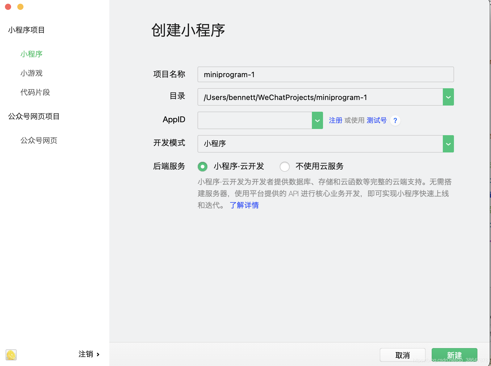
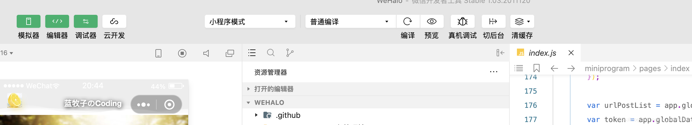
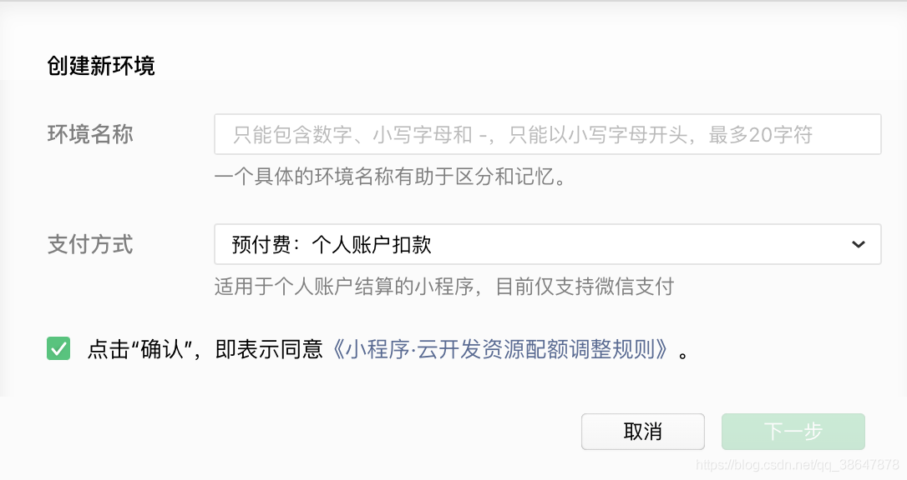
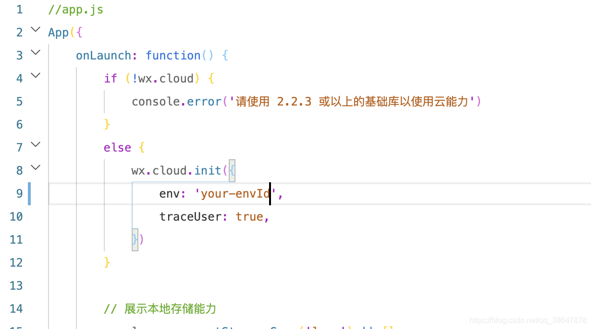

# 使用Halo建立自己的网站 #

Halo是一个开源的博客系统，有管理后台、评论模块、更换主题等等功能。以及有开源对应的一个微信小程序系统，很好用的。

Halo官方提供的文档：https://halo.run/archives/install-quick-start.html

Halo主题仓库：https://halo.run/p/themes.html

Halo小程序：WeHalo

下面是我自己在建站时的一些总结。

## 准备项 ##

- 云服务器一台
- 域名一个
- 小程序ID一个（这个后面再说）

服务器可以选择的有阿里云、腾讯云、华为云等等，太多了自己选一个就好。其中阿里云、腾讯云都有活动新注册用户80左右/年（差不多这个价），买的时候最好选择3年的，最划算，否则一年后续费价格就是原价（800～1200），相信我你不想用这个价格续费的。同样的域名最好也是直接买的年数长点，不过域名一般不会太贵（除非你买的域名是热门域名之类的），即使原价也能接受。

如果买的是国内的服务器，域名还需要备案等等，这些我会再出一篇文章来说。

## 云服务器配置 ##

云服务器从我的使用经验来说，1核2G的基本够用，带宽一般活动的都是1M的，这个不太够，用的时候会很卡（在ssh连接工具上输命令会很卡），不过其实也都还能接受。性价比最高自然是那个2核4G 3M的啦（如果还有的话）。

安装镜像时选择你喜欢的镜像就好，如果选不出来就选择centos吧，版本可以选择8.x的，目前算是最新的了。

## 安装Halo ##

这块按照官方文档安装完就完事了。

**jar包安装**

官方提供的文档：https://halo.run/archives/install-with-linux.html

**docker安装**

官方提供的文档：https://halo.run/archives/install-with-docker.html

我使用的是docker的方式，所以也给出我的docker启动命令.

启动Halo服务

	docker run -d --name halo -p 8090:8090 -v ~/.halo:/root/.halo --network=proxy-net --restart=always ruibaby/halo

启动Nginx服务

	docker run -d --name nginx --restart always --network=proxy-net -p 80:80 -p 443:443 -v /usr/local/nginx/nginx.conf:/etc/nginx/nginx.conf:ro -v /usr/local/nginx/cert:/etc/nginx/cert:ro nginx

**配置域名访问**

官方提供的文档：https://halo.run/archives/install-reverse-proxy.html

我用的是Nginx进行代理，证书使用的就是在域名提供商那里申请的免费证书。

我就直接放上我的nginx配置好了。

```
user  nginx;
worker_processes  1;

error_log  /var/log/nginx/error.log warn;
pid        /var/run/nginx.pid;


events {
    worker_connections  1024;
}


http {
    include       /etc/nginx/mime.types;
    default_type  application/octet-stream;

    log_format  main  '$remote_addr - $remote_user [$time_local] "$request" '
                      '$status $body_bytes_sent "$http_referer" '
                      '"$http_user_agent" "$http_x_forwarded_for"';

    access_log  /var/log/nginx/access.log  main;

    sendfile        on;
    #tcp_nopush     on;

    keepalive_timeout  65;

# 开启压缩传输，对网站seo有帮助
    gzip  on;
    gzip_min_length  1k;
    gzip_buffers     16 8k;
    gzip_http_version 1.1;
    gzip_comp_level 6;
    gzip_types       text/plain application/x-javascript text/css application/xml text/javascript application/x-httpd-php application/javascript application/json;
    gzip_disable "MSIE [1-6]\.";
    gzip_vary on;

    include /etc/nginx/conf.d/*.conf;

    server {
        listen   80 default_server;
	    listen   443 default_server;

	    server_name  _; # 禁止IP直接访问服务

	    ssl_certificate cert/yourcrt.crt; #换成你自己nginx证书
        ssl_certificate_key cert/yourkey.key; #换成你自己的证书密钥
        ssl_session_timeout 5m;
        ssl_protocols TLSv1 TLSv1.1 TLSv1.2;
        ssl_ciphers ECDHE-RSA-AES128-GCM-SHA256:HIGH:!aNULL:!MD5:!RC4:!DHE;
        ssl_prefer_server_ciphers on;

	    return 403; # 也可以换成非http code与客户端断开连接，或者重定向到网站首页
    }

    server {
        listen   80;
        server_name www.hibennett.cn hibennett.cn;
	    return 301 https://$host$request_uri;
    }

    server {
  	listen   443 ssl;
	
	server_name hibennett.cn;

	client_max_body_size 1024m;

	root html;
	index index.html index.htm;
	ssl_certificate cert/yourcrt.crt; #换成你自己nginx证书
    ssl_certificate_key cert/yourcrt.key; #换成你自己的证书密钥
    ssl_session_timeout 5m;
    ssl_protocols TLSv1 TLSv1.1 TLSv1.2;
	ssl_ciphers ECDHE-RSA-AES128-GCM-SHA256:HIGH:!aNULL:!MD5:!RC4:!DHE;
    ssl_prefer_server_ciphers on;
	
	location / {
	    proxy_pass  http://halo:8090/; # 我这里使用的docker的配置，jar包启动请换成 http://localhost:8090
	    proxy_redirect off;
	    proxy_set_header   Host   $host;
	    proxy_set_header X-Real-IP $remote_addr;
	    proxy_set_header X-Forwarded-For $proxy_add_x_forwarded_for;
	}
    }

    server {
        listen   443 ssl;

        server_name www.hibennett.cn;

        client_max_body_size 1024m;

        root html;
        index index.html index.htm;
        ssl_certificate cert/yourcrt.crt; #换成你自己nginx证书
        ssl_certificate_key cert/yourkey.key; #换成你自己的证书密钥
        ssl_session_timeout 5m;
        ssl_protocols TLSv1 TLSv1.1 TLSv1.2;
        ssl_ciphers ECDHE-RSA-AES128-GCM-SHA256:HIGH:!aNULL:!MD5:!RC4:!DHE;
        ssl_prefer_server_ciphers on;

        location / {
            proxy_pass  http://halo:8090/; # 我这里使用的docker的配置，jar包启动请换成 http://localhost:8090
            proxy_redirect off;
            proxy_set_header   Host   $host;
            proxy_set_header X-Real-IP $remote_addr;
            proxy_set_header X-Forwarded-For $proxy_add_x_forwarded_for;
        }
    }
}
```

服务器这里配置好了，还需要在服务器提供商那里将安全组里开放我们需要的端口，比如80、443端口。如果使用的jar包方式还需要开放8090端口(这个可以将访问的IP设置仅你的服务器公网IP可访问)。其他安全组规则，我建议22端口也是仅你长使用的几个IP可访问，虽然可能会经常变会很麻烦，但是相对的也安全了许多。

域名同样也需要在域名提供商那里配置域名的解析，把域名解析到你的服务器。添加两条记录@-A-{IP}和www-A-{IP}。（主机记录-记录类型-记录值）

## WeHalo服务 ##

首先需要注册一个微信小程序的ID，访问👉注册小程序

还需要👉下载微信开放者工具，下载稳定版的程序。如果在使用过程遇到什么问题，可以在其他版里看一看问题有没有被解决，如果都没有被解决可以给官方提issue。

然后下载WeHalo的源码，打开微信开放者工具，创建一个小程序，
填好项目名称，目录选择下载好的WeHalo源码目录，AppID填注册完给的ID，然后点创建。



**添加html2wxml插件**

开发者工具会提示你添加这个插件，如果未提示，在小程序管理后台设置->第三方设置->添加插件->搜索这个插件并添加

**设置合法的request域**

👉登录微信小程序，在开发->开发管理->开发设置->服务器域名->request合法域名中添加https://v2.jinrishici.com和自己的博客网站域名。

**开启云开发**



创建环境



等待创建完毕，将设置里的环境ID设置在app.js里



在cloudfunctions文件夹上右键选择环境为你刚创建的环境，如果没有可以把项目关闭重新打开。然后在get_wx_context和msg_sec_check文件夹上右键选择上传并部署：所有文件

修改配置

首先修改app.js里的配置

```
globalData: { //全局变量
        userInfo: null,
        skin: null,
        roleFlag: false,
        BlogName: "爱敲代码的猫",//博客名字
        url: "https://aquan.run",//博客地址（需HTTPS）
        token: "",//Halo博客后台设置（高级设置->API设置->AccessKey）
        highlightStyle: "dracula",//代码高亮样式，可用值default,darcula,dracula,tomorrow
        adminOpenid: "ogogn47AhczrMBgcTCPbUwugqLcU",//导入项目后可以在Console中看到  openidCloudResult: xxxxxxx  (xxx就是adminOpenid)// 清缓存重新编译
        HaloUser: "xx",//Halo后台用户名
        HaloPassword: "xx",//Halo后台密码
 }
```

设置个人专属Logo 修改 WeHalo\miniprogram\colorui\main.wxss 文件最后面的

```
.home-img{
    padding: 24rpx;
    background-repeat: no-repeat;
    background-size: contain;
    /* background-image:url(../image/cat.png); */
    background-image:url('xxxxx');//logo图片地址
}
```

- wh-authorCard.js：31行改为自己的github地址
- wh-authorCard.wxml：图片地址、标题、Email地址、GitHub地址更换

- page/index/index.js：分享模块添加一个函数，将原本的onShareAppMessage函数复制一份，把复制的追加在后面，并更改函数名为onShareTimeline（分享到朋友圈）。
- page/index/index.wxml：10行修改背景图，101行修改搜索结果的为空时的图

其他几个模块的js文件也都可以添加一个分享到朋友圈的函数。

然后在你的手机上预览下你的小程序，如果没有问题就可以准备上传发布了。

[从零搭建WeHalo视频](https://www.bilibili.com/video/BV1s5411Y7Pp)

上传发布
点击上传按钮将代码上传，然后填写版本号。

然后登录小程序的管理后台，在版本管理中将开发版本提交审核（在这之前将你的小程序基础信息完善下，避免出现审核不通过的问题）。

审核通过后就可以发布小程序了，发布之后你的小程序就可以被所有人搜索到并使用（前提是你的网站备案已通过，并且在公安部也备案好了，否则你的网站都不能使用更何况小程序了）。

下面是我的网站和小程序码，欢迎留言交换友链。

Bennett：https://hibennett.cn

描述：一杯清茶，一本书籍，一个明媚的下午！

Logo：https://source.hibennett.cn/blog/85CAFF29-5B1C-4B25-9685-F531F694792B_1605613051191.jpeg

蓝牧子coding：

————————————————

版权声明：本文为CSDN博主「BennettChina」的原创文章，遵循CC 4.0 BY-SA版权协议，转载请附上原文出处链接及本声明。

原文链接：https://blog.csdn.net/qq_38647878/article/details/110748814