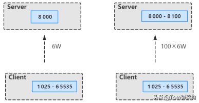
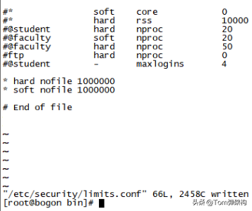
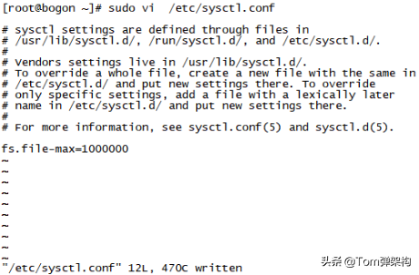
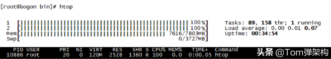
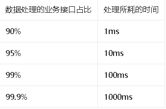
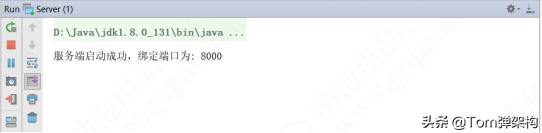
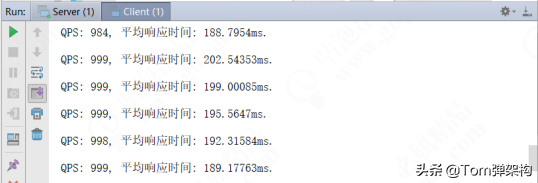
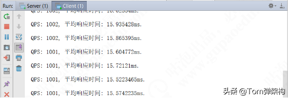
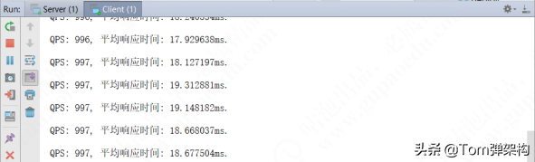

# 这样调优之后，单机也能扛下100W连接 #


原创2021-10-26 00:32·Tom弹架构

## 1 模拟单机连接瓶颈 ##

我们知道，通常启动一个服务端会绑定一个端口，例如8000端口，当然客户端连接端口是有限制的，除去最大端口65535和默认的1024端口及以下的端口，就只剩下1 024~65 535个，再扣除一些常用端口，实际可用端口只有6万个左右。那么，我们如何实现单机百万连接呢？ 假设在服务端启动[8 000,8 100）这100个端口，100×6万就可以实现600万左右的连接，这是TCP的一个基础知识，虽然对于客户端来说是同一个端口号，但是对于服务端来说是不同的端口号，由于TCP是一个私源组概念，也就是说它是由源IP地址、源端口号、目的IP地址和目的端口号确定的，当源IP地址和源端口号是一样的，但是目的端口号不一样，那么最终系统底层会把它当作两条TCP连接来处理，所以这里取巧给服务端开启了100个端口号，这就是单机百万连接的准备工作，如下图所示。



这样调优之后，单机也能扛下100W连接
单机1024及以下的端口只能给ROOT保留使用，客户端端口范围为1 02565 535，接下来用代码实现单机百万连接的模拟场景。先看服务端类，循环开启[8 0008 100）这100个监听端口，等待客户端连接。下面已Netty为例编写代码如下。

```
package com.tom.netty.connection;

import io.netty.bootstrap.ServerBootstrap;
import io.netty.channel.ChannelFuture;
import io.netty.channel.ChannelFutureListener;
import io.netty.channel.ChannelOption;
import io.netty.channel.EventLoopGroup;
import io.netty.channel.nio.NioEventLoopGroup;
import io.netty.channel.socket.nio.NioServerSocketChannel;

/**
 * @author Tom
 */
public final class Server {
    public static final int BEGIN_PORT = 8000;
    public static final int N_PORT = 8100;

    public static void main(String[] args) {
        new Server().start(Server.BEGIN_PORT, Server.N_PORT);
    }

    public void start(int beginPort, int nPort) {
        System.out.println("服务端启动中...");

        EventLoopGroup bossGroup = new NioEventLoopGroup();
        EventLoopGroup workerGroup = new NioEventLoopGroup();

        ServerBootstrap bootstrap = new ServerBootstrap();
        bootstrap.group(bossGroup, workerGroup);
        bootstrap.channel(NioServerSocketChannel.class);
        bootstrap.childOption(ChannelOption.SO_REUSEADDR, true);

        bootstrap.childHandler(new ConnectionCountHandler());


        for (int i = 0; i <= (nPort - beginPort); i++) {
            final int port = beginPort + i;

            bootstrap.bind(port).addListener(new ChannelFutureListener() {
                public void operationComplete(ChannelFuture channelFuture) throws Exception {
                    System.out.println("成功绑定监听端口: " + port);
                }
            });
        }
        System.out.println("服务端已启动!");
    }
}
```

然后看ConnectionCountHandler类的实现逻辑，主要用来统计单位时间内的请求数，每接入一个连接则自增一个数字，每2s统计一次，代码如下。

```
package com.tom.netty.connection;


import io.netty.channel.ChannelHandler;
import io.netty.channel.ChannelHandlerContext;
import io.netty.channel.ChannelInboundHandlerAdapter;

import java.util.concurrent.Executors;
import java.util.concurrent.TimeUnit;
import java.util.concurrent.atomic.AtomicInteger;

/**
 * Created by Tom.
 */
@ChannelHandler.Sharable
public class ConnectionCountHandler extends ChannelInboundHandlerAdapter {

    private AtomicInteger nConnection = new AtomicInteger();

    public ConnectionCountHandler() {
        Executors.newSingleThreadScheduledExecutor().scheduleAtFixedRate(new Runnable() {
            public void run() {
                System.out.println("当前客户端连接数: " + nConnection.get());
            }
        },0, 2, TimeUnit.SECONDS);

    }

    @Override
    public void channelActive(ChannelHandlerContext ctx) {
        nConnection.incrementAndGet();
    }

    @Override
    public void channelInactive(ChannelHandlerContext ctx) {
        nConnection.decrementAndGet();
    }

}
```

再看客户端类代码，主要功能是循环依次往服务端开启的100个端口发起请求，直到服务端无响应、线程挂起为止，代码如下。

```
package com.tom.netty.connection;


import io.netty.bootstrap.Bootstrap;
import io.netty.channel.*;
import io.netty.channel.nio.NioEventLoopGroup;
import io.netty.channel.socket.SocketChannel;
import io.netty.channel.socket.nio.NioSocketChannel;

/**
 * Created by Tom.
 */
public class Client {

    private static final String SERVER_HOST = "127.0.0.1";

    public static void main(String[] args) {
        new Client().start(Server.BEGIN_PORT, Server.N_PORT);
    }

    public void start(final int beginPort, int nPort) {
        System.out.println("客户端已启动...");
        EventLoopGroup eventLoopGroup = new NioEventLoopGroup();
        final Bootstrap bootstrap = new Bootstrap();
        bootstrap.group(eventLoopGroup);
        bootstrap.channel(NioSocketChannel.class);
        bootstrap.option(ChannelOption.SO_REUSEADDR, true);
        bootstrap.handler(new ChannelInitializer<SocketChannel>() {
            @Override
            protected void initChannel(SocketChannel ch) {
            }
        });


        int index = 0;
        int port;
        while (!Thread.interrupted()) {

            port = beginPort + index;
            try {
                ChannelFuture channelFuture = bootstrap.connect(SERVER_HOST, port);
                channelFuture.addListener(new ChannelFutureListener() {
                    public void operationComplete(ChannelFuture future) throws Exception {
                        if (!future.isSuccess()) {
                            System.out.println("连接失败，程序关闭!");
                            System.exit(0);
                        }
                    }
                });
                channelFuture.get();
            } catch (Exception e) {
            }

            if (port == nPort) { index = 0; }else { index ++; }
        }
    }
}
```

最后，将服务端程序打包发布到Linux服务器上，同样将客户端程序打包发布到另一台Linux服务器上。接下来分别启动服务端和客户端程序。运行一段时间之后，会发现服务端监听的连接数定格在一个值不再变化，如下所示。


    当前客户端连接数: 870
    当前客户端连接数: 870
    当前客户端连接数: 870
    当前客户端连接数: 870
    当前客户端连接数: 870
    当前客户端连接数: 870
    当前客户端连接数: 870
    当前客户端连接数: 870
    当前客户端连接数: 870
    ...

并且抛出如下异常。

```
Exception in thread "nioEventLoopGroup-2-1" java.lang.InternalError: java.io.FileNotFoundException: /usr/java/jdk1.8.0_121/jre/lib/ext/cldrdata.jar (Too many open files)
        at sun.misc.URLClassPath$JarLoader.getResource(URLClassPath.java:1040)
        at sun.misc.URLClassPath.getResource(URLClassPath.java:239)
        at java.net.URLClassLoader$1.run(URLClassLoader.java:365)
        at java.net.URLClassLoader$1.run(URLClassLoader.java:362)
        at java.security.AccessController.doPrivileged(Native Method)
        at java.net.URLClassLoader.findClass(URLClassLoader.java:361)
        at java.lang.ClassLoader.loadClass(ClassLoader.java:424)
        at java.lang.ClassLoader.loadClass(ClassLoader.java:411)
        at sun.misc.Launcher$AppClassLoader.loadClass(Launcher.java:331)
        at java.lang.ClassLoader.loadClass(ClassLoader.java:357)
        at java.util.ResourceBundle$RBClassLoader.loadClass(ResourceBundle.java:503)
        at java.util.ResourceBundle$Control.newBundle(ResourceBundle.java:2640)
        at java.util.ResourceBundle.loadBundle(ResourceBundle.java:1501)
        at java.util.ResourceBundle.findBundle(ResourceBundle.java:1465)
        at java.util.ResourceBundle.findBundle(ResourceBundle.java:1419)
        at java.util.ResourceBundle.getBundleImpl(ResourceBundle.java:1361)
        at java.util.ResourceBundle.getBundle(ResourceBundle.java:845)
        at java.util.logging.Level.computeLocalizedLevelName(Level.java:265)
        at java.util.logging.Level.getLocalizedLevelName(Level.java:324)
        at java.util.logging.SimpleFormatter.format(SimpleFormatter.java:165)
        at java.util.logging.StreamHandler.publish(StreamHandler.java:211)
        at java.util.logging.ConsoleHandler.publish(ConsoleHandler.java:116)
        at java.util.logging.Logger.log(Logger.java:738)
        at io.netty.util.internal.logging.JdkLogger.log(JdkLogger.java:606)
        at io.netty.util.internal.logging.JdkLogger.warn(JdkLogger.java:482)
        at io.netty.util.concurrent.SingleThreadEventExecutor$5.run (SingleThreadEventExecutor.java:876)
        at io.netty.util.concurrent.DefaultThreadFactory$DefaultRunnableDecorator.run (DefaultThreadFactory.java:144)
        at java.lang.Thread.run(Thread.java:745)
```

这个时候，我们就应该要知道，这已经是服务器所能接受客户端连接数量的瓶颈值，也就是服务端最大支持870个连接。接下来要做的事情是想办法突破这个瓶颈，让单台服务器也能支持100万连接，这是一件多么激动人心的事情。

## 2 单机百万连接调优解决思路 ##

**2.1 突破局部文件句柄限制**

首先在服务端输入命令，看一下单个进程所能支持的最大句柄数。


    ulimit -n

输入命令后，会出现1 024的数字，表示Linux系统中一个进程能够打开的最大文件数，由于开启一个TCP连接就会在Linux系统中对应创建一个文件，所以就是受这个文件的最大文件数限制。那为什么前面演示的服务端连接数最终定格在870，比1 024小呢？其实是因为除了连接数，还有JVM打开的文件Class类也算作进程内打开的文件，所以，1 024减去JVM打开的文件数剩下的就是TCP所能支持的连接数。 接下来想办法突破这个限制，首先在服务器命令行输入以下命令，打开/etc/security/limits.conf文件。


    sudo vi /etc/security/limits.conf

然后在这个文件末尾加上下面两行代码。


    * hard nofile 1000000
    * soft nofile 1000000

前面的*表示当前用户，hard和soft分别表示限制和警告限制，nofile表示最大的文件数标识，后面的数字1 000 000表示任何用户都能打开100万个文件，这也是操作系统所能支持的最大值，如下图所示。



这样调优之后，单机也能扛下100W连接
接下来，输入以下命令。


    ulimit -n

这时候，我们发现还是1 024，没变，重启服务器。将服务端程序和客户端程序分别重新运行，这时候只需静静地观察连接数的变化，最终连接数停留在137 920，同时抛出了异常，如下所示。


    当前客户端连接数: 137920
    当前客户端连接数: 137920
    当前客户端连接数: 137920
    当前客户端连接数: 137920
    当前客户端连接数: 137920
    Exception in thread "nioEventLoopGroup-2-1" java.lang.InternalError: java.io.FileNotFoundException: /usr/java/jdk1.8.0_121/jre/lib/ext/cldrdata.jar (Too many open files)
    ...

这又是为什么呢？肯定还有地方限制了连接数，想要突破这个限制，就需要突破全局文件句柄数的限制。

**2.2 突破全局文件句柄限制**

首先在Linux命令行输入以下命令，可以查看Linux系统所有用户进程所能打开的文件数。


    cat /proc/sys/fs/file-max

通过上面这个命令可以看到全局的限制，发现得到的结果是10 000。可想而知，局部文件句柄数不能大于全局的文件句柄数。所以，必须将全局的文件句柄数限制调大，突破这个限制。首先切换为ROOT用户，不然没有权限。


    sudo  -s
    echo 2000> /proc/sys/fs/file-max
    exit

我们改成20 000来测试一下，继续试验。分别启动服务端程序和客户端程序，发现连接数已经超出了20 000的限制。 前面使用echo来配置/proc/sys/fs/file-max的话，重启服务器就会失效，还会变回原来的10 000，因此，直接用vi命令修改，输入以下命令行。


    sodu vi /etc/sysctl.conf

在/etc/sysctl.conf文件末尾加上下面的内容。


    fs.file-max=1000000

结果如下图所示。



这样调优之后，单机也能扛下100W连接
接下来重启 Linux服务器，再启动服务端程序和客户端程序。


    当前客户端连接数: 9812451
    当前客户端连接数: 9812462
    当前客户端连接数: 9812489
    当前客户端连接数: 9812501
    当前客户端连接数: 9812503
    ...

最终连接数定格在 98万左右。我们发现主要受限于本机本身的性能。用htop命令查看一下，发现CPU都接近100%，如下图所示。



这样调优之后，单机也能扛下100W连接
以上是操作系统层面的调优和性能提升，下面主要介绍基于Netty应用层面的调优。

## 3 Netty应用级别的性能调优 ##

**3.1 Netty应用级别的性能瓶颈复现**

首先来看一下应用场景，下面是一段标准的服务端应用程序代码。


```
package com.tom.netty.thread;


import io.netty.bootstrap.ServerBootstrap;
import io.netty.channel.*;
import io.netty.channel.nio.NioEventLoopGroup;
import io.netty.channel.socket.SocketChannel;
import io.netty.channel.socket.nio.NioServerSocketChannel;
import io.netty.handler.codec.FixedLengthFrameDecoder;

/**
 * Created by Tom.
 */
public class Server {

    private static final int port = 8000;

    public static void main(String[] args) {

        EventLoopGroup bossGroup = new NioEventLoopGroup();
        EventLoopGroup workerGroup = new NioEventLoopGroup();
        final EventLoopGroup businessGroup = new NioEventLoopGroup(1000);

        ServerBootstrap bootstrap = new ServerBootstrap();
        bootstrap.group(bossGroup, workerGroup)
                .channel(NioServerSocketChannel.class)
                .childOption(ChannelOption.SO_REUSEADDR, true);


        bootstrap.childHandler(new ChannelInitializer<SocketChannel>() {
            @Override
            protected void initChannel(SocketChannel ch) {
                //自定义长度的解码，每次发送一个long类型的长度数据
                //每次传递一个系统的时间戳
                ch.pipeline().addLast(new FixedLengthFrameDecoder(Long.BYTES));
                ch.pipeline().addLast(businessGroup, ServerHandler.INSTANCE);
            }
        });


        ChannelFuture channelFuture = bootstrap.bind(port).addListener(new ChannelFutureListener() {
            public void operationComplete(ChannelFuture channelFuture) throws Exception {
                System.out.println("服务端启动成功，绑定端口为: " + port);
            }
        });
    }

}
```

我们重点关注服务端的逻辑处理ServerHandler类。

```
package com.tom.netty.thread;


import io.netty.buffer.ByteBuf;
import io.netty.buffer.Unpooled;
import io.netty.channel.ChannelHandler;
import io.netty.channel.ChannelHandlerContext;
import io.netty.channel.SimpleChannelInboundHandler;

import java.util.concurrent.ThreadLocalRandom;

/**
 * Created by Tom.
 */
@ChannelHandler.Sharable
public class ServerHandler extends SimpleChannelInboundHandler<ByteBuf> {
    public static final ChannelHandler INSTANCE = new ServerHandler();


    //channelread0是主线程
    @Override
    protected void channelRead0(ChannelHandlerContext ctx, ByteBuf msg) {
        ByteBuf data = Unpooled.directBuffer();
        //从客户端读一个时间戳
        data.writeBytes(msg);
        //模拟一次业务处理，有可能是数据库操作，也有可能是逻辑处理
        Object result = getResult(data);
        //重新写回给客户端
        ctx.channel().writeAndFlush(result);
    }

    //模拟去数据库获取一个结果
    protected Object getResult(ByteBuf data) {

        int level = ThreadLocalRandom.current().nextInt(1, 1000);

        //计算出每次响应需要的时间，用来作为QPS的参考数据

        //90.0% == 1ms   1000 100 > 1ms
        int time;
        if (level <= 900) {
            time = 1;
        //95.0% == 10ms    1000 50 > 10ms
        } else if (level <= 950) {
            time = 10;
        //99.0% == 100ms    1000 10 > 100ms
        } else if (level <= 990) {
            time = 100;
        //99.9% == 1000ms    1000 1 > 1000ms
        } else {
            time = 1000;
        }

        try {
            Thread.sleep(time);
        } catch (InterruptedException e) {
        }

        return data;
    }

}
```

上面代码中有一个getResult()方法。可以把getResult()方法看作是在数据库中查询数据的一个方法，把每次查询的结果返回给客户端。实际上，为了模拟查询数据性能，getResult()传入的参数是由客户端传过来的时间戳，最终返回的还是客户端传过来的值。只不过返回之前做了一次随机的线程休眠处理，以模拟真实的业务处理性能。如下表所示是模拟场景的性能参数。

数据处理的业务接口占比 | 处理所耗的时间



90% | 1ms
95% | 10ms
99% | 100ms
99.9% | 1000ms

下面来看客户端，也是一段标准的代码。

```
package com.tom.netty.thread;


import io.netty.bootstrap.Bootstrap;
import io.netty.channel.ChannelInitializer;
import io.netty.channel.ChannelOption;
import io.netty.channel.EventLoopGroup;
import io.netty.channel.nio.NioEventLoopGroup;
import io.netty.channel.socket.SocketChannel;
import io.netty.channel.socket.nio.NioSocketChannel;
import io.netty.handler.codec.FixedLengthFrameDecoder;

/**
 * Created by Tom.
 */
public class Client {

    private static final String SERVER_HOST = "127.0.0.1";

    public static void main(String[] args) throws Exception {
        new Client().start(8000);
    }

    public void start(int port) throws Exception {
        EventLoopGroup eventLoopGroup = new NioEventLoopGroup();
        final Bootstrap bootstrap = new Bootstrap();
        bootstrap.group(eventLoopGroup)
                .channel(NioSocketChannel.class)
                .option(ChannelOption.SO_REUSEADDR, true)
                .handler(new ChannelInitializer<SocketChannel>() {
                    @Override
                    protected void initChannel(SocketChannel ch) {
                        ch.pipeline().addLast(new FixedLengthFrameDecoder(Long.BYTES));
                        ch.pipeline().addLast(ClientHandler.INSTANCE);
                    }
        });

        //客户端每秒钟向服务端发起1 000次请求
        for (int i = 0; i < 1000; i++) {
            bootstrap.connect(SERVER_HOST, port).get();
        }
    }
}
```

从上面代码中看到，客户端会向服务端发起1 000次请求。重点来看客户端逻辑处理ClientHandler类。

```
package com.tom.netty.thread;


import io.netty.buffer.ByteBuf;
import io.netty.channel.ChannelHandler;
import io.netty.channel.ChannelHandlerContext;
import io.netty.channel.SimpleChannelInboundHandler;

import java.util.concurrent.TimeUnit;
import java.util.concurrent.atomic.AtomicInteger;
import java.util.concurrent.atomic.AtomicLong;

/**
 * Created by Tom.
 */
@ChannelHandler.Sharable
public class ClientHandler extends SimpleChannelInboundHandler<ByteBuf> {
    public static final ChannelHandler INSTANCE = new ClientHandler();

    private static AtomicLong beginTime = new AtomicLong(0);
    //总响应时间
    private static AtomicLong totalResponseTime = new AtomicLong(0);
    //总请求数
    private static AtomicInteger totalRequest = new AtomicInteger(0);

    public static final Thread THREAD = new Thread(){
        @Override
        public void run() {
            try {
                while (true) {
                    long duration = System.currentTimeMillis() - beginTime.get();
                    if (duration != 0) {
                        System.out.println("QPS: " + 1000 * totalRequest.get() / duration + ", " + "平均响应时间: " + ((float) totalResponseTime.get()) / totalRequest.get() + "ms.");
                        Thread.sleep(2000);
                    }
                }

            } catch (InterruptedException ignored) {
            }
        }
    };

    @Override
    public void channelActive(final ChannelHandlerContext ctx) {
        ctx.executor().scheduleAtFixedRate(new Runnable() {
            public void run() {
                ByteBuf byteBuf = ctx.alloc().ioBuffer();
                //将当前系统时间发送到服务端
                byteBuf.writeLong(System.currentTimeMillis());
                ctx.channel().writeAndFlush(byteBuf);
            }
        }, 0, 1, TimeUnit.SECONDS);
    }

    @Override
    protected void channelRead0(ChannelHandlerContext ctx, ByteBuf msg) {
        //获取一个响应时间差，本次请求的响应时间
        totalResponseTime.addAndGet(System.currentTimeMillis() - msg.readLong());
        //每次自增
        totalRequest.incrementAndGet();

        if (beginTime.compareAndSet(0, System.currentTimeMillis())) {
            THREAD.start();
        }
    }

}
```

上面代码主要模拟了Netty真实业务环境下的处理耗时情况，QPS大概在1 000次，每2s统计一次。接下来，启动服务端和客户端查看控制台日志。首先运行服务端，看到控制台日志如下图所示。



这样调优之后，单机也能扛下100W连接
然后运行客户端，看到控制台日志如下图所示，一段时间之后，发现QPS保持在1 000次以内，平均响应时间越来越长。





回到服务端ServerHander的getResul()方法，在getResult()方法中有线程休眠导致阻塞，不难发现，它最终会阻塞主线程，导致所有的请求挤压在一个线程中。如果把下面的代码放入线程池中，效果将完全不同。


    Object result =getResult(data);
    ctx.channel().wrteAndFlush(result);

把这两行代码放到业务线程池里，不断在后台运行，运行完成后即时返回结果。

**3.2 Netty应用级别的性能调优方案**

下面来改造一下代码，在服务端的代码中新建一个ServerThreadPoolHander类。

```
package com.tom.netty.thread;


import io.netty.buffer.ByteBuf;
import io.netty.buffer.Unpooled;
import io.netty.channel.ChannelHandler;
import io.netty.channel.ChannelHandlerContext;

import java.util.concurrent.ExecutorService;
import java.util.concurrent.Executors;

/**
 * Created by Tom.
 */
@ChannelHandler.Sharable
public class ServerThreadPoolHandler extends ServerHandler {
    public static final ChannelHandler INSTANCE = new ServerThreadPoolHandler();
    private static ExecutorService threadPool = Executors.newFixedThreadPool(1000);


    @Override
    protected void channelRead0(final ChannelHandlerContext ctx, ByteBuf msg) {
        final ByteBuf data = Unpooled.directBuffer();
        data.writeBytes(msg);
        threadPool.submit(new Runnable() {
            public void run() {
                Object result = getResult(data);
                ctx.channel().writeAndFlush(result);
            }
        });

    }
}
```

然后在服务端的Handler处理注册为ServerThreadPoolHander，删除原来的ServerHandler，代码如下。


	ch.pipeline().addLast(ServerThreadPoolHandler.INSTANCE);


随后，启动服务端和客户端程序，查看控制台日志，如下图所示。



这样调优之后，单机也能扛下100W连接
最终耗时稳定在15ms左右，QPS也超过了1 000次。实际上这个结果还不是最优的状态，继续调整。将ServerThreadPoolHander的线程个数调整到20，代码如下。


    public static final ChannelHandler INSTANCE = new ServerThreadPoolHandler();
    private static ExecutorService threadPool = Executors.newFixedThreadPool(20);


然后启动程序，发现平均响应时间相差也不是太多，如下图所示。



这样调优之后，单机也能扛下100W连接
由此得出的结论是：具体的线程数需要在真实的环境下不断地调整、测试，才能确定最合适的数值。本章旨在告诉大家优化的方法，而不是结果。

本文为“Tom弹架构”原创，转载请注明出处。技术在于分享，我分享我快乐！
如果本文对您有帮助，欢迎关注和点赞；如果您有任何建议也可留言评论或私信，您的支持是我坚持创作的动力。关注微信公众号『 Tom弹架构 』可获取更多技术干货！