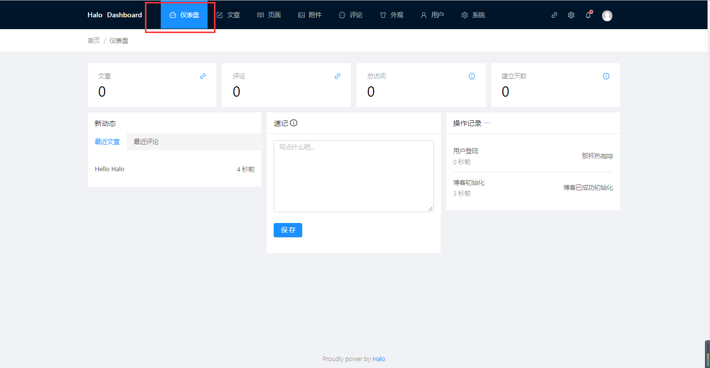
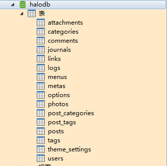
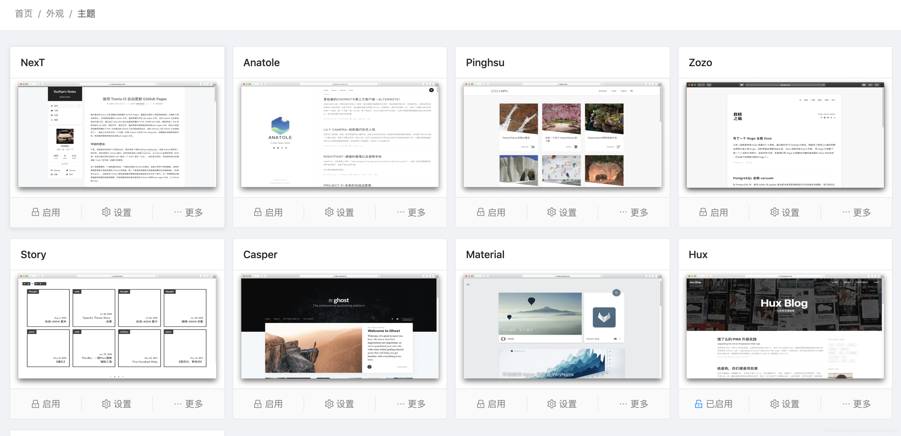
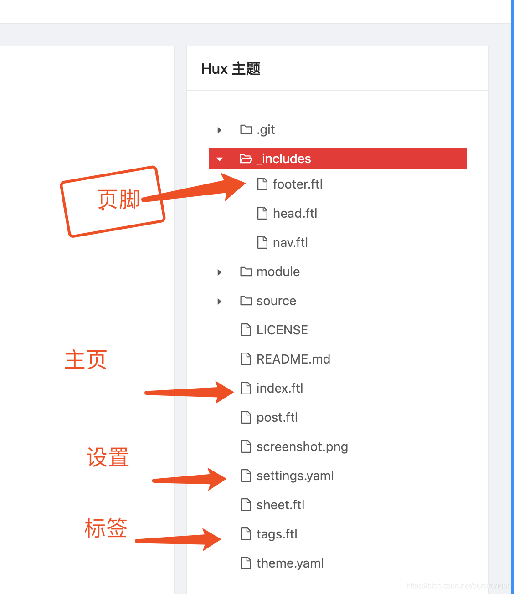

# 手把手教学使用Halo搭建自己的博客网站 #

工作需要学习，学习需要积累。网上有很多好的博客系统。我们可以去"CSDN"，"博客园"等这种大厂提供的博客空间，也可以自己搭建高逼格的独立博客。例如，适合github的hexo，大众的wordpress，OneBlog，Tale等。对比了一波，我选择halo这款博客系统。对于我它有以下几个优点：

（1）java语言实现，适合java程序员。

（2）动态的主题切换（特别炫支持移动端，响应式页面）

（3）完善的后台管理功能操作方便。

（4）部署超级简单，五分钟完成搭建。

（5）站点迁移方便，复制文件一键迁移。

下面讲讲如何搭建Halo，在这之前，购买自己的云服务器，备案自己的域名。这是搭建自己站点，拉取流量的基础；我这里是阿里云，域名备案也直接在阿里云备案：

使用 Docker 部署 Halo

使用 Docker 部署 Halo 的指南，假设你已经安装Docker 并了解它的基本使用。本篇教程以 CentOS 7.x 为例，其他系统大同小异。

**1. 环境要求**

为了在使用过程中不出现意外的事故，给出下列推荐的配置 CentOS 7.x 1G 以上内存

**2. 服务器配置，配置 Docker 运行环境**

请确保服务器的软件包已经是最新的。

	sudo yum update -y

启动 Docker 后台服务

	sudo systemctl start docker

**3. 安装 Halo**

1. 自定义配置文件

考虑到部分用户的需要，可能需要自定义比如端口等设置项，我们提供了公共的配置文件，并且该配置文件是完全独立于安装包的。当然，你也可以使用安装包内的默认配置文件，但是安装包内的配置文件是不可修改的。请注意：配置文件的路径为 ~/.halo/application.yaml。

	curl -o ~/.halo/application.yaml --create-dirs http://halo.ryanc.cc/config/application-template.yaml

2. 修改配置文件

完成上一步操作，我们就可以自己配置 Halo 的运行端口，以及数据库相关的配置了。

	vim ~/.halo/application.yaml

打开之后我们可以看到：

H2 配置如下：

```
  port: 8090
spring:
  datasource:
    type: com.zaxxer.hikari.HikariDataSource
 
    # H2 Database 配置
    driver-class-name: org.h2.Driver
    url: jdbc:h2:file:~/.halo/db/halo
    username: admin
    password: openadmin
  h2:
    console:
      settings:
        web-allow-others: false
      path: /h2-console
      enabled: false
```

MySQL 配置如下：

```
  port: 8090
spring:
  datasource:
    # MySQL 配置
    driver-class-name: com.mysql.cj.jdbc.Driver
    url: jdbc:mysql://127.0.0.1:3306/halodb?characterEncoding=utf8&useSSL=false&serverTimezone=Asia/Shanghai
    username: root
    password: openroot
```

- 如果需要自定义端口，修改 server 节点下的 port 即可。
- 默认使用的是 H2 Database 数据库，这是一种嵌入式的数据库，使用起来非常方便。需要注意的是，默认的用户名和密码为 admin 和 123456，这个是自定义的，最好将其修改，并妥善保存。
- 如果需要使用 MySQL 数据库，需要将 H2 Database 的所有相关配置都注释掉，并取消 MySQL 的相关配置。另外，MySQL 的默认数据库名为 halodb，请自行配置 MySQL 并创建数据库，以及修改配置文件中的用户名和密码。
- h2 节点为 H2 Database 的控制台配置，默认是关闭的，如需使用请将 h2.console.settings.web-allow-others 和 h2.console.enabled 设置为 true。控制台地址即为 域名/h2-console。注意：非紧急情况，不建议开启该配置。

3. 拉取最新 Halo 镜像

	sudo docker pull ruibaby/halo

4. 创建容器并运行
 
	docker run --name halo -d -p 8090:8090  -v ~/.halo:/root/.halo ruibaby/halo

完成以上操作即可通过 ip:端口 访问了。端口默认是8090可以在配置文件或者启动时添加参数修改。虽然可以访问，但是端口暴露很不安全，后续第5步是如何配置域名访问。

4.1 打开博客进行博客的初始化操作。初始化完成进入admin管理页面。



点击右上角头像位置最左边的按钮，跳转到博客首页。设置主题!

4.2 创建数据库，不需要创建表结构，初始化应用的时候自动生成。

重启服务，打开地址，我们再一次初始化博客。打开数据库，可以看到表和数据已经初始化好了： 



服务搭建完成，解释一下后台配置，特别是主题配置

4.3 菜单分为仪表盘，文章，页面，附件，评论，外观，用户，系统这几个，重点解释一下外观。外观菜单可以设置博客的主题显示效果。打开菜单如下：



4.4 如何修改主题打开编辑主题页面：



可以根据自己的喜好设置自己的页面效果，可以自定义友情链接，社交网点等。

**5.配置域名访问**

使用 Caddy 进行反向代理。Caddy 是一款使用 Go 语言开发的 Web 服务器。其配置更为简洁，并可以自动申请及配置 SSL 证书（这里推荐使用）。

5.1 安装 Caddy

```
# 安装 Caddy 软件包
yum install caddy -y
```

5.2 配置 Caddy

```
# 下载 Halo 官方的 Caddy 配置模板
curl -o /etc/caddy/conf.d/Caddyfile.conf --create-dirs http://halo.ryanc.cc/config/Caddyfile
```

5.3 下载完成之后，我们还需要对其进行修改。

```
# 使用 vim 编辑 Caddyfile
vim /etc/caddy/conf.d/Caddyfile.conf
```

5.4 打开之后我们可以看到

```
https://www.simple.com {
 gzip
 tls xxxx@xxx.xx
 proxy / localhost:port {
  transparent
 }
}
```

(1)请把 https://www.simple.com 改为自己的域名。

(2)tls 后面的 xxxx@xxx.xx 改为自己的邮箱地址，这是用于自动申请 SSL 证书用的。需要注意的是，不需要你自己配置 SSL 证书，而且会自动帮你续签。

(3)localhost:port 请将 port 修改为 Halo 的运行端口，默认为 8090。

5.5 修改完成之后启动 Caddy 服务即可。

```
# 开启自启 Caddy 服务
systemctl enable caddy
 
# 启动 Caddy
service caddy start
 
# 停止运行 Caddy
service caddy stop
 
# 重启 Caddy
service caddy restart
 
# 查看 Caddy 运行状态
service caddy status
```

注意: 如果 Caddy 启动出现诸如 [/usr/lib/systemd/system/caddy.service:23] Unknown lvalue 'AmbientCapabilities' in section 'Service' 这样的问题，请使用 yum update -y 更新系统。然后再使用 service caddy restart 重启，已知 CentOS 7.3 会出现该问题。

**6.进阶设置**

多网址重定向到主网址，比如访问 simple.com 跳转到 www.simple.com 应该怎么做呢？

使用 vim 编辑 Caddyfile

	vim /etc/caddy/conf.d/Caddyfile.conf

打开之后我们在原有的基础上添加以下配置:

```
https://simple.com {
  redir https://www.simple.com{url}
}
```

将 https://simple.com 和  https://www.simple.com修改为自己需要的网址就行了，比如我要求访问 ryanc.cc 跳转到www.ryanc.cc ,完整的配置如下：

```
http://ryanc.cc {
  redir https://www.ryanc.cc{url}
}
 
https://www.ryanc.cc {
  gzip
  tls i@ryanc.cc
  proxy / localhost:8090 {
    transparent
  }
}
```

最后我们(service caddy restart)重启 Caddy 即可。

到这里，关于 Caddy 反向代理的配置也就完成了，现在你可以访问一下自己的域名，并进行 Halo 的初始化了。

注意: 在设置了反向代理之后，请一定记得去 halo 的管理端设置一下正确的博客地址，否则会造成资源获取不成功。

参考: 

个人博客：https://www.itmengtao.cn

官网：https://docs.halo.run/install/docker

https://ailijie.top/archives/hello-halo

————————————————

版权声明：本文为CSDN博主「李多肉同学」的原创文章，遵循CC 4.0 BY-SA版权协议，转载请附上原文出处链接及本声明。

原文链接：https://blog.csdn.net/ourstronger/article/details/103772640