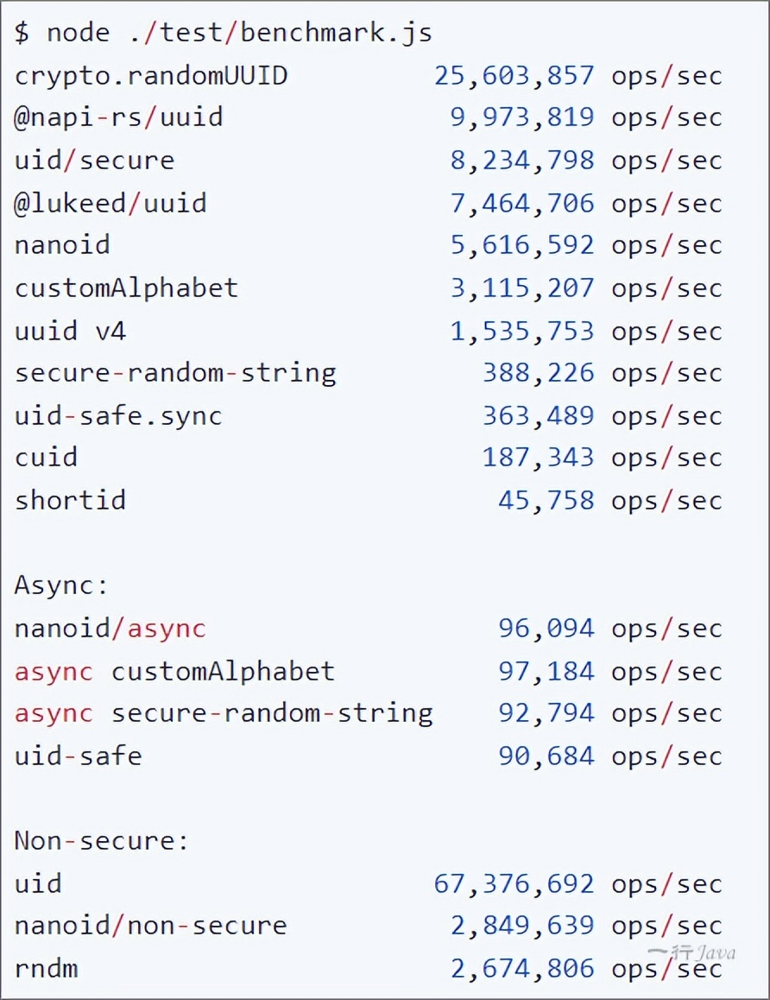

# 换掉 UUID，NanoID 更快、更短、更安全

> 原文链接：  
> https://mp.weixin.qq.com/s/7gLxbTsv_VPquJoaLa9T4Q

UUID 是软件开发中最常用的通用标识符之一。然而，在过去的几年里，其他的竞品挑战了它的存在。

其中，NanoID 是 UUID 的主要竞争对手之一。

因此，在本文中，我们将展开讨论 NanoID 的功能、它的亮点以及它的局限性，以便让我们更好地了解何时使用它。


# NanoID的特点

# 1. NanoID 只有 108 个字节那么大

与 UUID 不同，NanoID 的大小要小 4.5 倍，并且没有任何依赖关系。此外，大小限制已用于将大小从另外 35% 减小。

大小减少直接影响数据的大小。例如，使用 NanoID 的对象小而紧凑，能够用于数据传输和存储。随着应用程序的增长，这些数字变得明显起来。

# 2. 更安全

在大多数随机生成器中，它们使用不安全的 Math.random()。但是，NanoID 使用 crypto module 和 Web Crypto API，意味着 NanoID 更安全。

此外，NanoID 在 ID 生成器的实现过程中使用了自己的算法，称为 统一算法，而不是使用“随机 % 字母表” random % alphabet。

# 3. 它既快速又紧凑

由于内存分配的技巧，NanoID 比 UUID 快 60%。与 UUID 字母表中的 36 个字符不同，NanoID 只有 21 个字符。

```
0123456789ABCDEFGHIJKLMNOPQRSTUVWXYZ_abcdefghijklmnopqrstuvwxyz-
```

由于字母表更大，需要超过 1 万亿年，才能有 1% 的概率至少发生一次碰撞，因此较短的 ID 可以用于与较长的 UUID 相同的目的。


> 碰撞所需时间和概率测试：http://dw-z.ink/2jHeh

此外，NanoID 支持 14 种不同的编程语言，它们分别是：

> C#, C++, Clojure and ClojureScript, Crystal, Dart & Flutter, Deno, Go, Elixir, Haskell, Janet, Java, Nim, Perl, PHP, Python with dictionaries, Ruby , Rust, Swift

# 4. 兼容性

它还支持 PouchDB、CouchDB WebWorkers、Rollup 以及 React 和 Reach-Native 等库。

我们可以使用 npx nanoid 在终端中获得唯一 ID。在 JavaScript 中使用 NanoID 唯一的要求是要先安装 NodeJS。


此外，我们还可以在 Redux toolkit 中找到 NanoID，并将其用于其他用例，如下所示；

```
import { nanoid } from ‘@reduxjs/toolkit’  
console.log(nanoid()) //‘dgPXxUz_6fWIQBD8XmiSy’
```

# 5. 自定义字母

NanoID 的另一个现有功能是它允许开发人员使用自定义字母表。我们可以更改文字或 id 的大小，如下所示：

```
import { customAlphabet } from 'nanoid';  
const nanoid = customAlphabet('ABCDEF1234567890', 12);  
model.id = nanoid();
```

在上面的示例中，我将自定义字母表定义为 ABCDEF1234567890，并将 Id 的大小定义为 12。

# 6. 没有第三方依赖

由于 NanoID 不依赖任何第三方依赖，随着时间的推移，它能够变得更加稳定自治。

从长远来看，这有利于优化包的大小，并使其不太容易出现依赖项带来的问题。

# 使用

# NodeJS

NanoID 每周的 NPM 下载量超过 1175.4 万，并且运行起来比 UUID 快 60%

- 安装`npm i nanoid`
- 使用

```
    import { nanoid } from 'nanoid';  
    model.id = nanoid();
```

# Java

- 添加依赖（方式一）<dependency>  

```
  <groupId>com.aventrix.jnanoid</groupId>  
  <artifactId>jnanoid</artifactId>  
  <version>2.0.0</version>  
  </dependency>
```

- 自定义工具类（方式二）；二选一即可

```
import java.security.SecureRandom;
import java.util.Random;

public class NanoIdUtils {
    public static final SecureRandom DEFAULT_NUMBER_GENERATOR = new SecureRandom();
    public static final char[] DEFAULT_ALPHABET = "_-0123456789abcdefghijklmnopqrstuvwxyzABCDEFGHIJKLMNOPQRSTUVWXYZ".toCharArray();
    public static final int DEFAULT_SIZE = 21;

    private NanoIdUtils() {
        //Do Nothing  
    }

    public static String randomNanoId() {
        return randomNanoId(DEFAULT_NUMBER_GENERATOR, DEFAULT_ALPHABET, 21);
    }

    public static String randomNanoId(Random random, char[] alphabet, int size) {
        if (random == null) {
            throw new IllegalArgumentException("random cannot be null.");
        } else if (alphabet == null) {
            throw new IllegalArgumentException("alphabet cannot be null.");
        } else if (alphabet.length != 0 && alphabet.length < 256) {
            if (size <= 0) {
                throw new IllegalArgumentException("size must be greater than zero.");
            } else {
                int mask = (2 << (int) Math.floor(Math.log((double) (alphabet.length - 1)) / Math.log(2.0D))) - 1;
                int step = (int) Math.ceil(1.6D * (double) mask * (double) size / (double) alphabet.length);
                StringBuilder idBuilder = new StringBuilder();
                while (true) {
                    byte[] bytes = new byte[step];
                    random.nextBytes(bytes);
                    for (int i = 0; i < step; ++i) {
                        int alphabetIndex = bytes[i] & mask;
                        if (alphabetIndex < alphabet.length) {
                            idBuilder.append(alphabet[alphabetIndex]);
                            if (idBuilder.length() == size) {
                                return idBuilder.toString();
                            }
                        }
                    }
                }
            }
        } else {
            throw new IllegalArgumentException("alphabet must contain between 1 and 255 symbols.");
        }
    }
}
```

- 使用String nanoId = NanoIdUtils.randomNanoId();  
  // aqiPmNG5kG6wtNIZP1g8d

# 更多其他的语言

更多其他语言的工具类，可查看：https://github.com/aventrix/jnanoid#other-programming-languages


# 未来趋势

NanoID 比 UUID 年轻了将近 7 年，而且它的 GitHub 星数已经比 UUID 多；下图显示了这两个之间的 npm 趋势比较，我们可以看到 NanoID 的上升趋势与 UUID 的下滑趋势有强烈的对比。

> **“**
> 
> https://www.npmtrends.com/nanoid-vs-uuid




来源：https://www.npmjs.com/package/nanoid

上述基准测试显示了 NanoID 与其他主要 id 生成器相比的性能。

> **“**
> 
> 使用默认字母表每秒可生成超过 220 万个唯一 ID，使用自定义字母表每秒可生成超过 180 万个唯一 ID。

根据我使用 UUID 和 NanoID 的经验，考虑到它的小尺寸、URL 友好性、安全性和速度，我建议在任何未来的项目中使用 NanoID 而不是 UUID。
